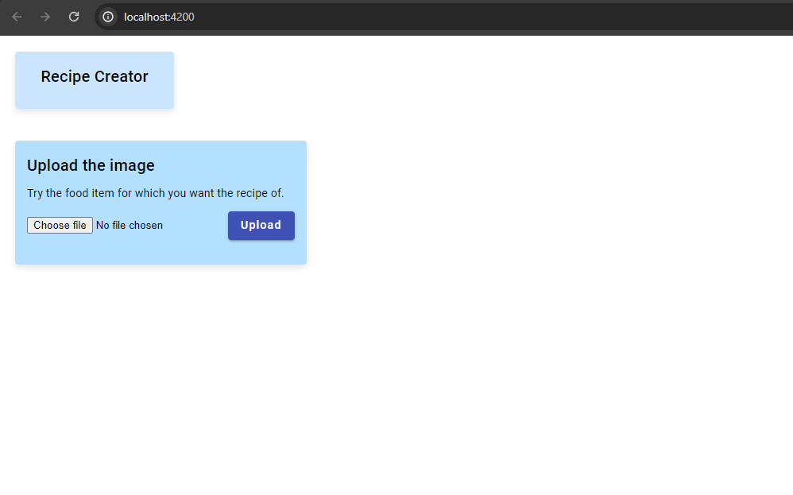
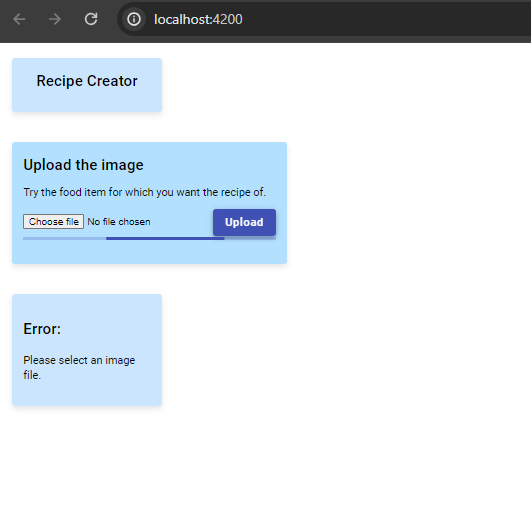
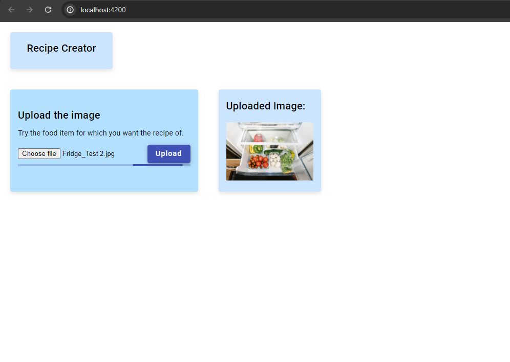
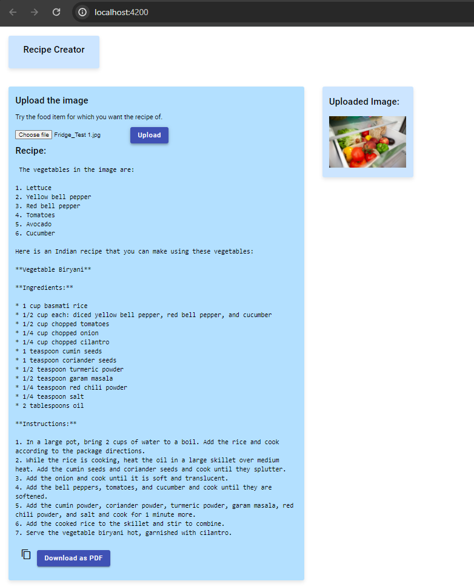
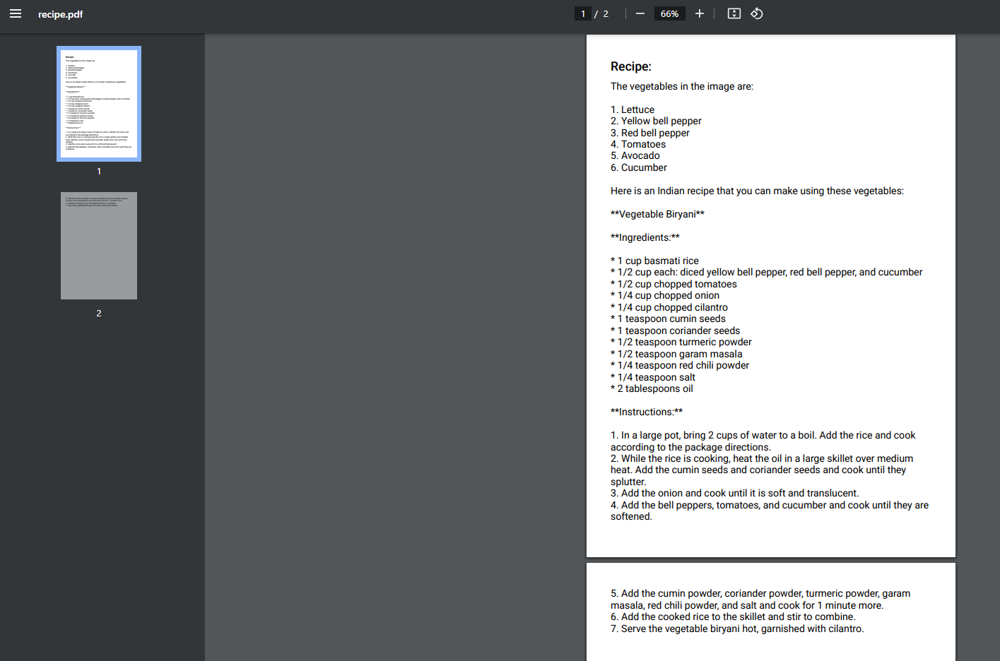

# Recipe Creator

## Overview

This is a full-stack recipe creator application that allows users to convert images of ingredients into text and then provides recipes based on the identified ingredients. The application uses the Geimin API for recipe suggestions.

The project is divided into two main components:

- Frontend: Angular
- Backend: Python with Flask

## Features

- Retrieving recipes based on identified ingredients
- User-friendly interface for seamless interaction
- Ability to download the created recipes.

## Technologies Used

### Frontend

- Angular: A modern and powerful front-end framework
- Angular Material: Material Design components for Angular applications

### Backend

- Python: A versatile programming language
- Flask: A lightweight web framework for Python

## Setup Instructions

### Frontend

1. Navigate to the `frontend` directory.
2. Install dependencies: `npm install`
3. Run the development server: `ng serve`

### Backend

1. Navigate to the `backend` directory.
2. Set up a virtual environment: `python -m venv venv`
3. Activate the virtual environment:
   - On Windows: `venv\Scripts\activate`
   - On Unix or MacOS: `source venv/bin/activate`
4. Install dependencies: `pip install -r requirements.txt`
5. Run the Flask application: `python app.py`

## Usage

1. Access the application at `http://localhost:4200` in your web browser.
2. Upload an image containing ingredients.
3. Click on the "Upload" button to extract ingredients from the image that can be used to for a particular recipe.
4. Then those ingredients will be used to create a recipe as per the indian style.
5. The Created recipe can be copied.
6. Also can be downloaded as a PDFfile.

## API Integration

This project integrates with the Geimin API for recipe suggestions. Ensure that you have the necessary API keys and configure them in the appropriate files.

## Sample Images

_Home_

_Not uploading the Image_

_Uploading the image_

_Creation of recipe_

_PDF Creation of recipe_

## Contributors

- [Shivam Dubey]
